## Task 1
*Версия Ubuntu*

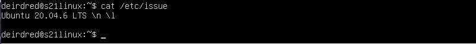

## Task 2
*Добавление пользователя*

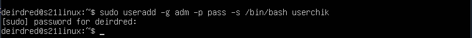

*Новый пользователь в выводе команды "cat /etc/passwd"*

## Task 3
- lo - он же localhost или 127.0.0.1 это виртуальный сетевой интерфейс для обеспечения доступа к локальной машине из сети
- DHCP - Dynamic Host Configuration Protocol (Протокол динамической настройки узла)

1. Через настройки виртуальной машины, во вкладке Основное изменил название на user-1
2. Нашёл в каталоге /usr/share/zoneinfo/ нужный временной пояс. Создал на него символическую ссылку "ln -sf /user/share/zoneinfo/Europe/Moscow /etc/localtime". Проверил успешность смены пояса командой date
3. Выполнил команду "ls /sys/class/net"
4. Выполнил команду ifconfig
5. Для внутреннего ip-адреса выполнил команду ip addr | grep inet. Для внешнего ip-адреса выполнил команду "wget -qO- ifconfig.me/ip"
6. Создал файл конфигурации .yaml в /etc/netplan/ с настройками текущего шлюза и ip-адресом заданного диапазона. Предварительно присвоил настройке dhcp значение false
7. После перезагрузки проверил, использованными ранее, командами присвоенный ip и параметр static командой "ip route show match 0/0"

*ping 1.1.1.1*

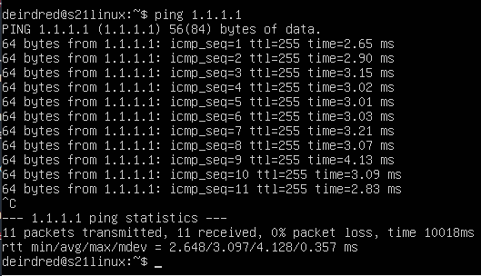

*ping ya.ru*

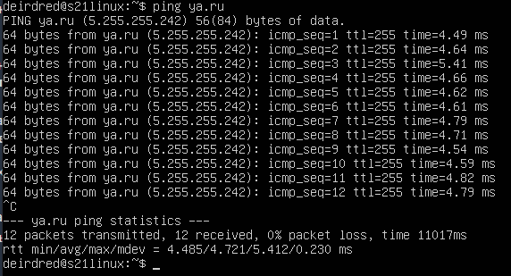

## Task 4
*Обновления отсутствуют*

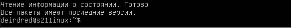

## Task 5
- sudo -  Substitute User and do, команда предоставляющая пользователю возможность выполнять команды от имени суперпользователя root, либо других пользователей

*Смена hostname от имени другого пользователя*

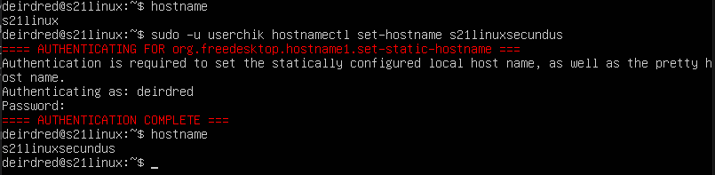

## Task 6
*Время часового пояса*

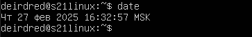

*Вывод "timedatectl show"*

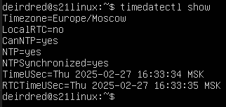

## Task 7
*редактор VIM*

*редактор NANO*

*редактор MCEdit*

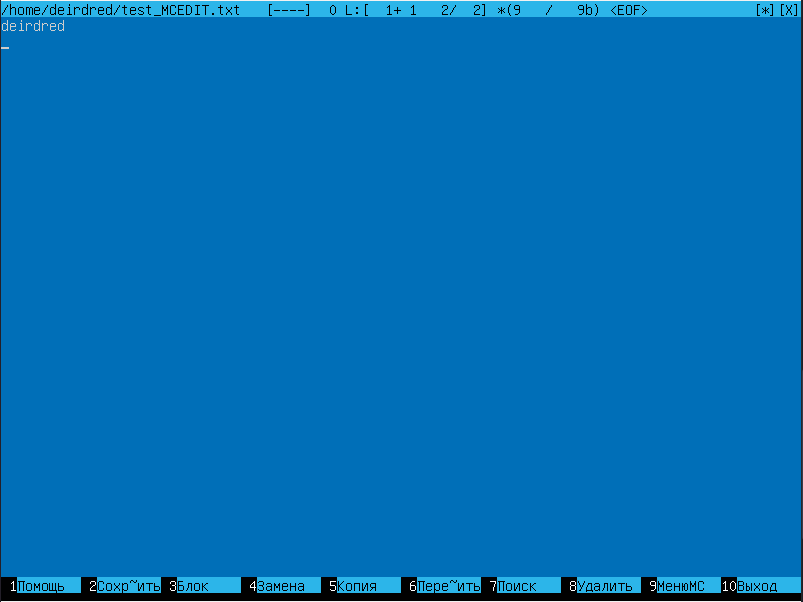

- VIM: выход из режима редактирования на ESC и ввод команды :wq
- NANO: Ctrl+X, подтверждение сохранения клавишей "y" и Enter
- MCEdit: клавиша F2, подтверждение сохранения и клавиша F10

*редактор VIM после редактирования*

*редактор NANO после редактирования*

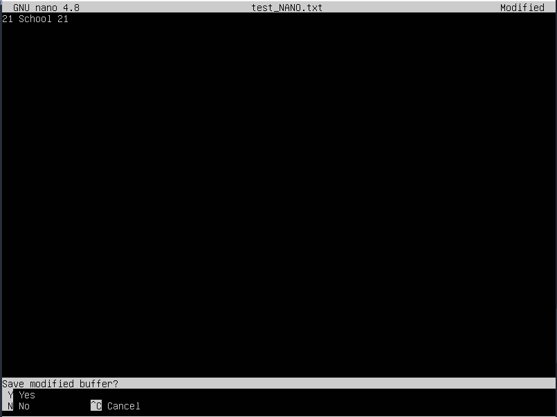

*редактор MCEdit после редактирования*

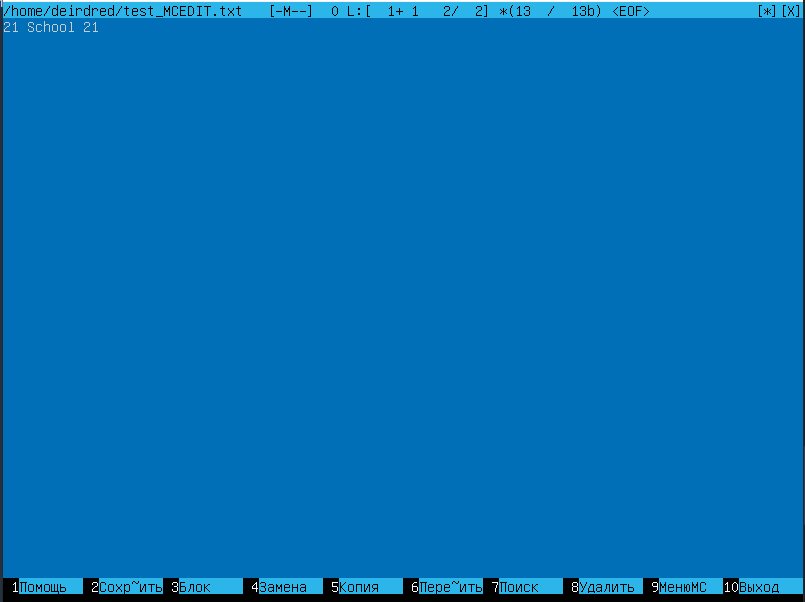

- VIM: выход из режима редактирования на ESC и ввод команды :q!
- NANO: Ctrl+X и отказ от сохранения клавишей "n"
- MCEdit: клавиша F10 и подтверждение отказа от сохранения

*поиск в редакторе VIM*

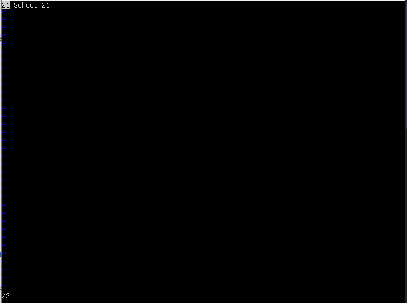

*поиск в редакторе NANO*

*поиск в редакторе MCEdit*

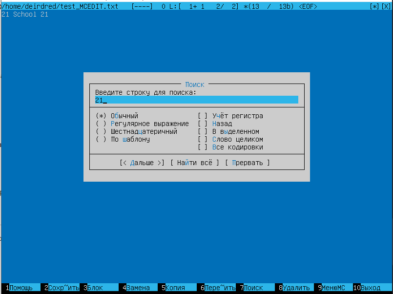

*замена в редакторе VIM*

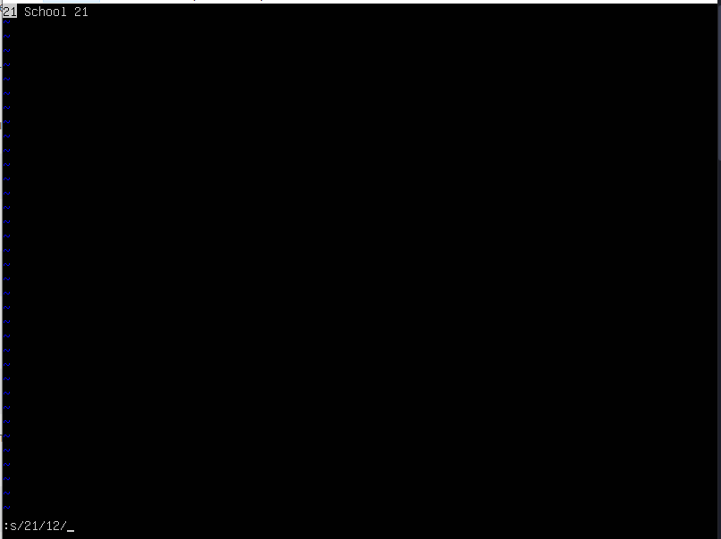

*замена в редакторе NANO пункт 1*

*замена в редакторе NANO пункт 2*

*замена в редакторе NANO пункт 3*

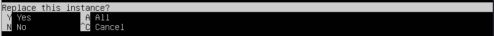

*замена в редакторе MCEdit*

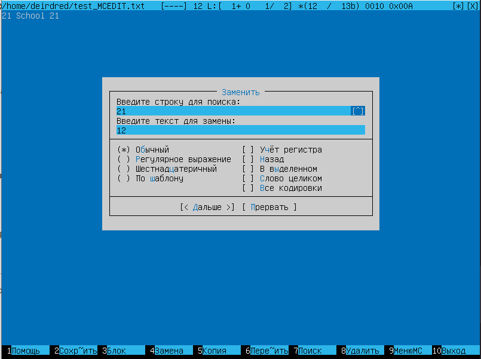

## Task 8
1. команда "sudo get-apt install ssh"
2. команда "sudo systemctl enable ssh"
3. при помощи редактора vim изменил значение порта в файле конфигурации sshd_config с 22 на 2022
4. команда "ps -C sshd" (ps - вывод активных процессов; -С - вывод процессов по имени команды; наименование искомого сервиса)
5. команда reboot

*вывод netstat -tan*

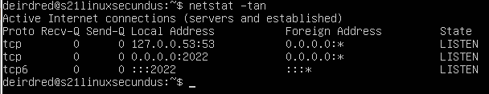

-tan:
 - -t - отображает TCP-соединения
 - -a - показывает все прослушивающие порты и активные соединения
 - -n - показывает числовые адреса вместо разрешения хостов и портов)
 
Вывод netstat:
- **Proto** - протокол
- **Recv-Q** - данные, ожидающие получения
- **Send-Q** - данные, ожидающие отправки
- **Local Address** - локальная конечная точка соединения
- **Foreign Address** - удаленная конечная точка соединения
- **State** - состояние соединения
0.0.0.0 в выводе netstat:
- указывает на то, что программа прослушивает порт на всех сетевых интерфейсах данной машины

## Task 9

- uptime - 32 min
- количество авторизованных пользователей - 1 user
- средняя загрузка системы - 0,02
- общее количество процессов - 97
- загрузка cpu - 0,3
- загрузка памяти - 146,5
- pid процесса занимающего больше всего памяти - 1155
- pid процесса, занимающего больше всего процессорного времени - 1155

*вывод htop отсортированный по PID*

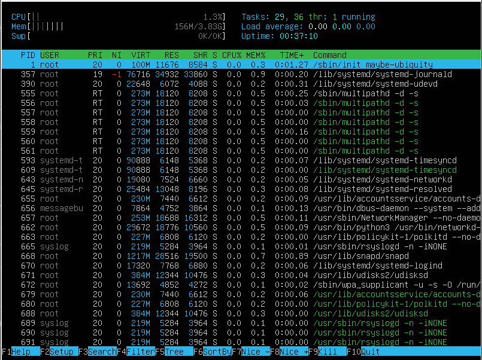

*вывод htop отсортированный по PERSENT_CPU*

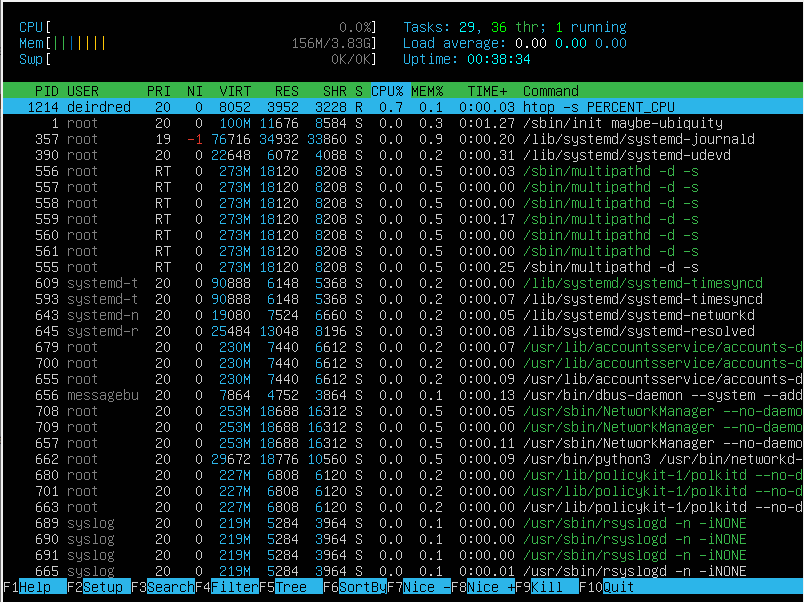

*вывод htop отсортированный по PERCENT_MEM*

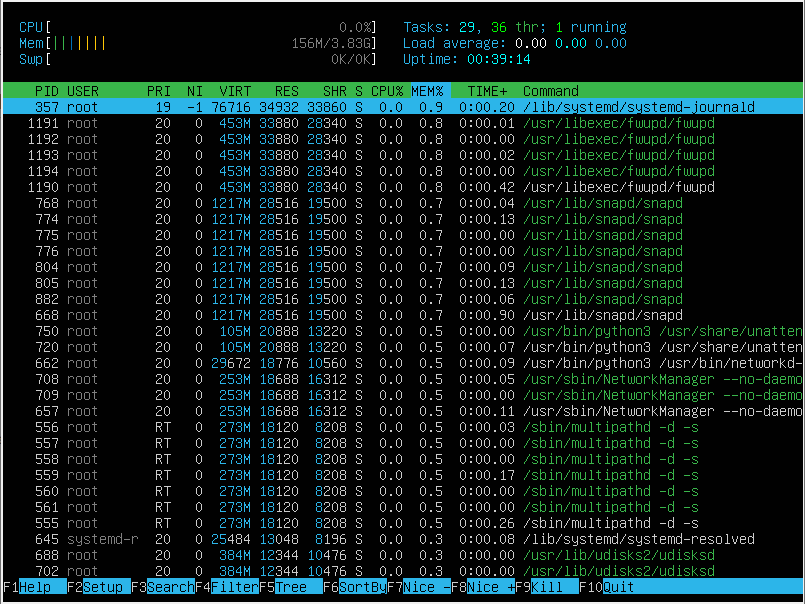

*вывод htop отсортированный по TIME*

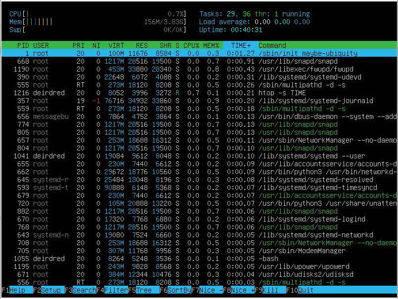

*вывод htop отсортированный для процесса sshd*

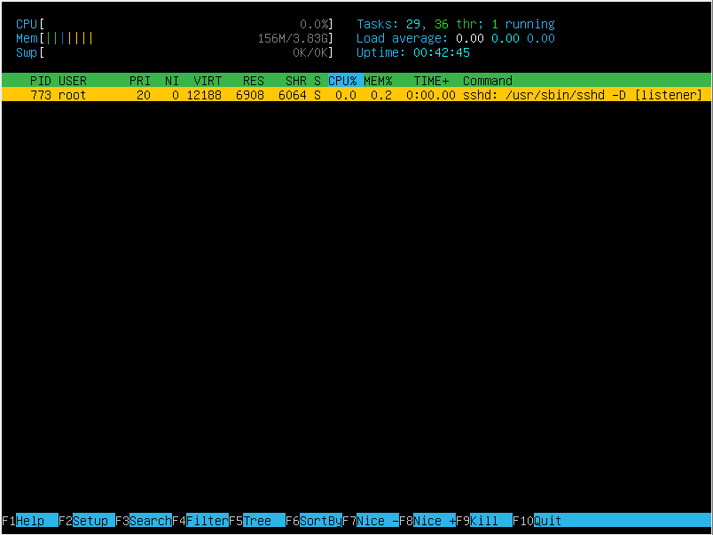

*вывод htop с процессом syslog, найденным через поиск*

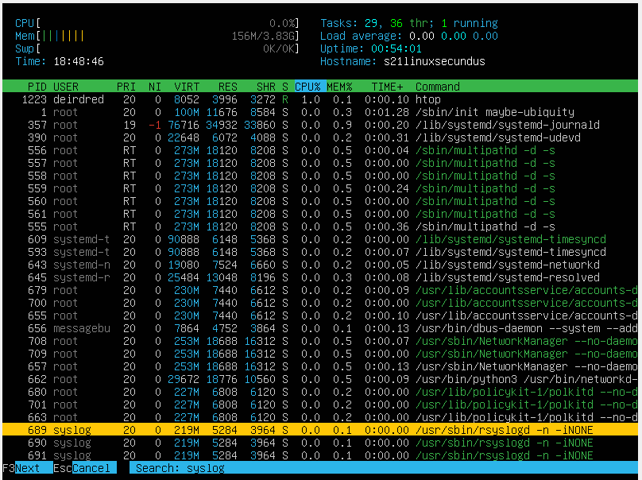

*вывод htop с добавленными hostname и clock*

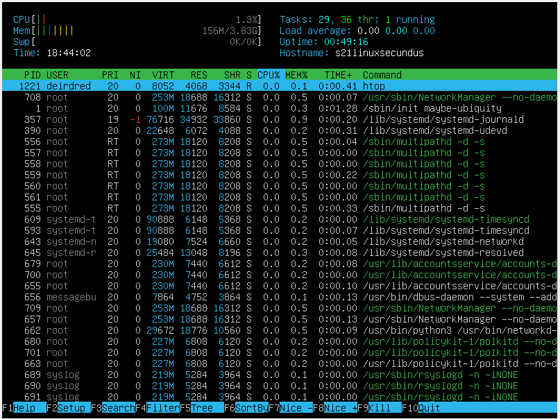

## Task 10
- Диск /dev/sda, 20 GiB, 41943040 sectors, 1,8G

## Task 11
**df**:
- 10218772 K
- 3429704 K
- 6248396 K
- 36%
- Измеряется в килобайтах

**df -Th**:
- 9,8 G
- 3,3 G
- 6 ,0 G
- 36%
- type ext4

## Task 12
*исполнение "du"*

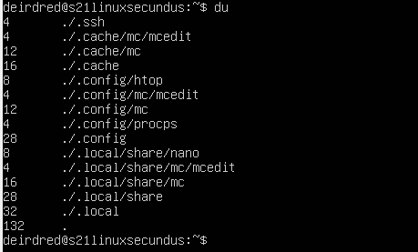

*вывод /home в байтах*

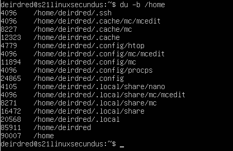

*вывод /home в человекочитаемых единицах*

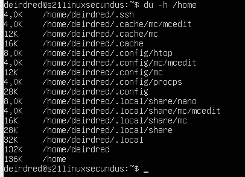

*вывод /var в байтах*

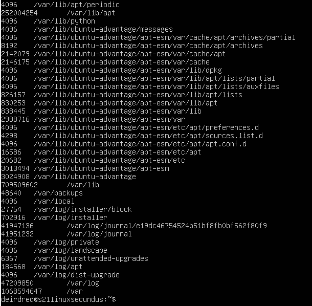

*вывод /var в человекочитаемых единицах*

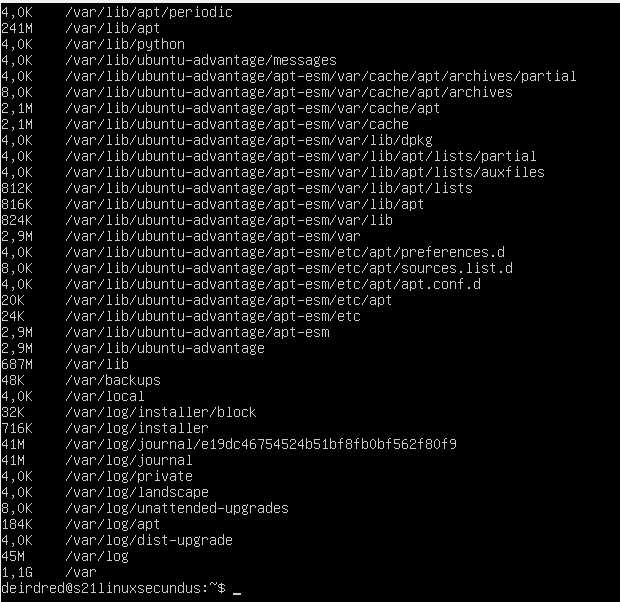

*вывод /var/log в байтах*

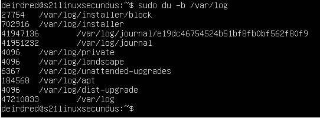

*вывод /var/log в человекочитаемых единицах*

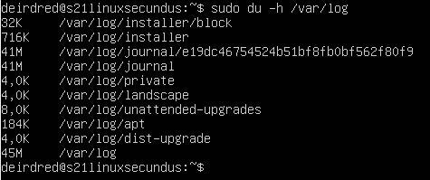

*вывод всего содержимого var/log/*

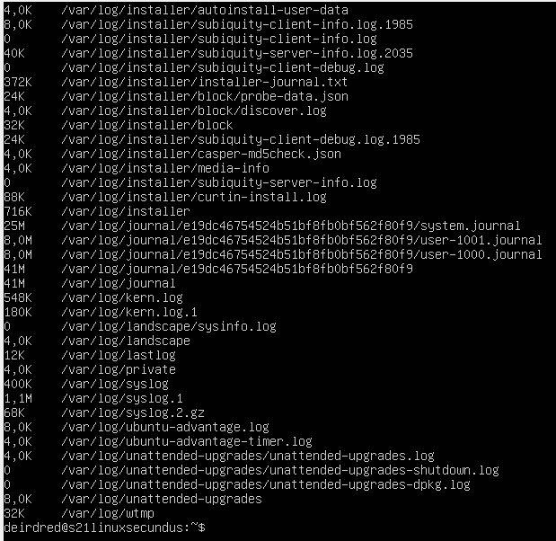

## Task 13
*команда установки ncdu*

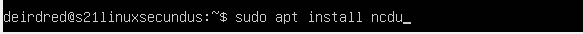

*команда анализа всей файловой системы*

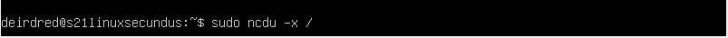

*размер папок /home и /var*

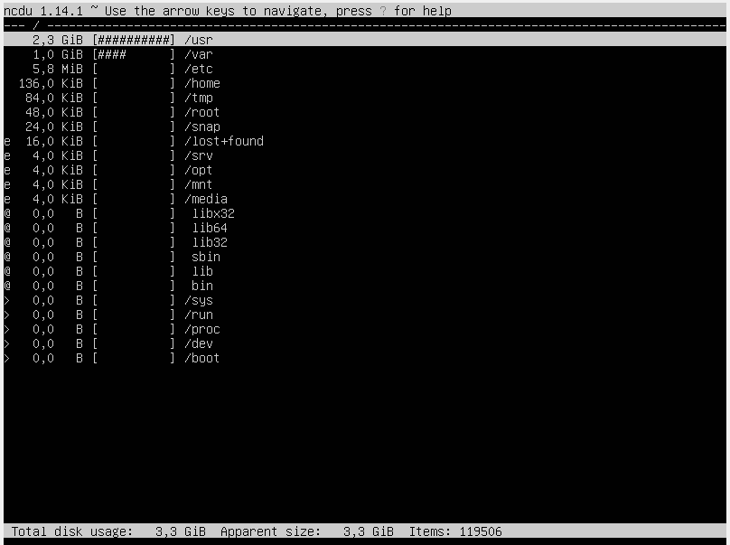

*размер папки var/log*

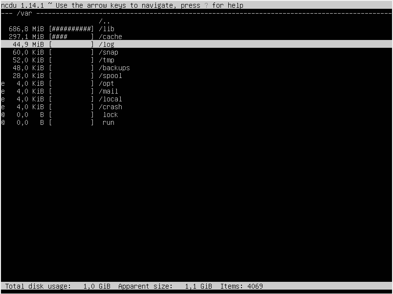

## Task 14
- Feb 27 16:20:47
- deirdred
- local

*перезапуск службы SSHd*

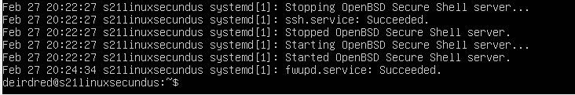

## Task 15
*строки выполнения команды uptime*

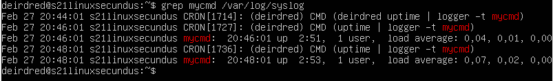

*список текущих задач CRON*

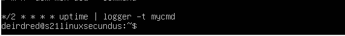

*список текущих задач CRON после очистки*

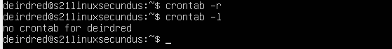
